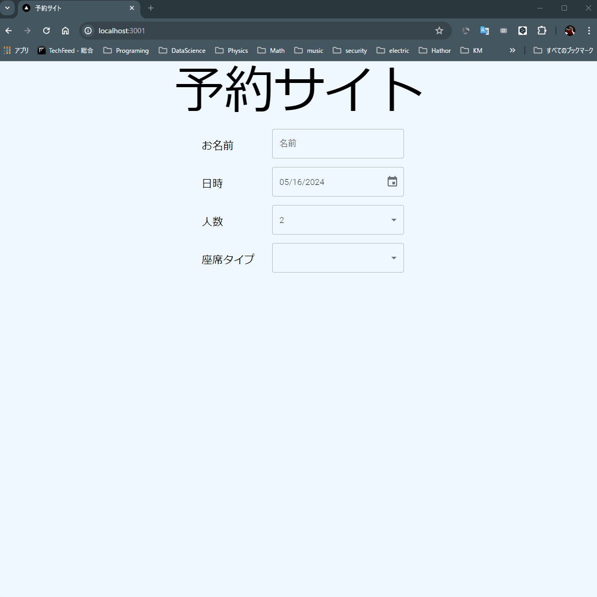
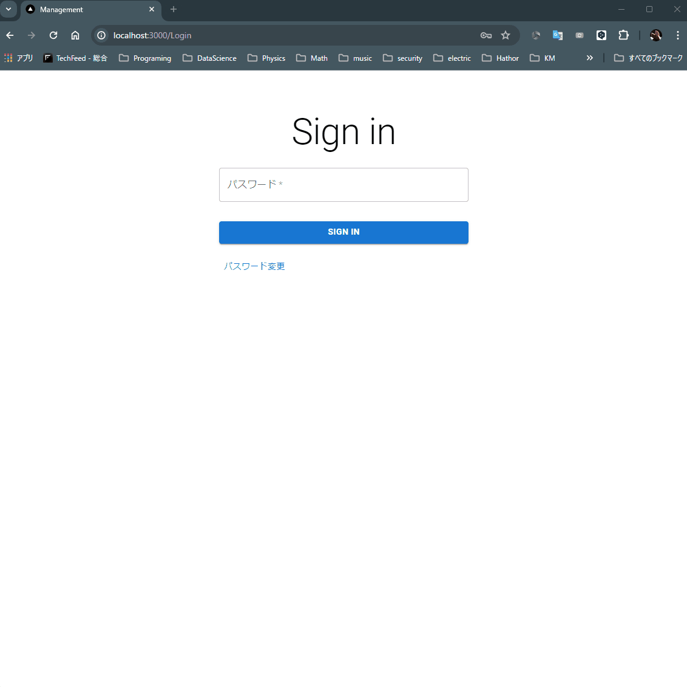

# カフェ予約管理サービス

このプロジェクトは、人気のカフェの予約管理を行うためのWebサービスです。予約システムと管理システムの2つの主要コンポーネントがあります。

## 仕様

### 予約システム
- **予約枠**: 1時間単位で予約可能
- **座席タイプ**: (./backend/tabledata.jsonlで定義)
  - 屋内: 2人用、4人用、6人用
  - テラス席: 2人用、4人用、6人用
- **予約時の入力情報**:
  - 名前
  - 人数
  - 時間
  - 席タイプ
- **本人確認**: 来店時に受付番号と名前で本人確認

### 管理システム
- **予約情報確認**: 日付を指定してその日の予約一覧を表示
- **予約操作**:
  - 予約済みに変更
  - 予約キャンセル
- **ログイン機能**: 一定時間でトークンが切れるため再ログインが必要
- **パスワード変更機能**: パスワードの変更が可能

## 機能

### 予約システム
- 空いている座席のみを表示
- 希望タイプの座席から希望人数に最も近いキャパシティーの座席を選定し、予約時に座席を確定

### 管理システム
- 予約情報の閲覧と操作
- セッション管理

## 技術

### フロントエンド
- 予約、管理サイト: React,Next.jsを使用

### バックエンド
- フレームワーク: Flask
- データベース: SQLite

## セットアップ

1. ./backendに移動してServerを起動します
    ```bash
    python app.py
    ```
2. ./reservation ./managementフォルダ直下に.envを作成し、1でflaskサーバー起動時のIPアドレスを以下のように記載する
    ```bash
    NEXT_PUBLIC_BACKEND_API_URL=https://{ flask server ip}:334/
    ```
3. ./reservation ./managementにそれぞれ移動し、依存関係をインストールします。
    ```bash
    npm install
    ```
4. フロントエンド側を起動します。
    - フロントエンド:
      ```bash
      npm run dev
      ```
※ flaskサーバー側の証明書はいわゆるオレオレ証明でそのままだとブラウザではじかれてしまうので、一度 https:// {flask server ip}:334/　にアクセスしてアクセスを許可してください。(証明書がgitに上がってるはかなり問題ですが。。。)
## 使用方法

- 予約サイトにアクセスし、必要な情報を入力して予約を行います。
- 管理サイトにログインし、予約情報を確認・管理します。

## 動作映像
- 予約サイト


- 管理サイト

